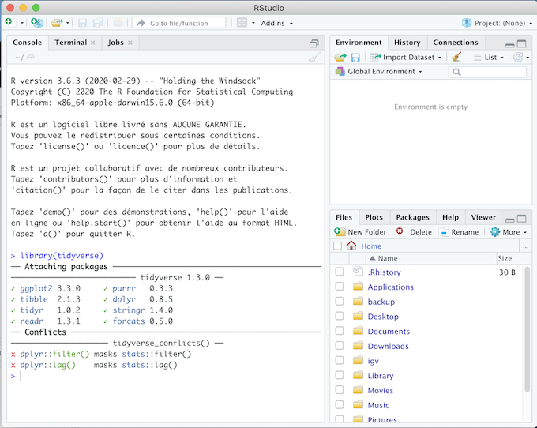

**Où:** A indiquer

**Quand:** Du 14 Octobre 2021 au 2 Décembre 2021

**Instructeurs:** 
[Sandra Cortijo](mailto:sandra.cortijo@cnrs.fr), 
[Océane Cassan](mailto:Oceane.CASSAN@cnrs.fr)

## Description

Ce cours va vous apprendre comment exporer des données et réaliser des graphiques dans **R**. 
Les différentes séances sont:
- 14/10/2021 8h-11h15 : Organisation des données dans excel, nettoyage des données avec OpenRefine et intro à R (qu'est-ce que R, R studio, une variable, une fonction).
- 21/10/2021 8h-11h15: Réaliser des graphiques en utilisant **ggplot2** dans **R**. 
- 28/10/2021 8h-11h15: Reflexion meilleurs graphs pour representer donnees. Manipulation des données dans **R** (filtrer, sélectionner, modifier données, extraire statistiques descriptive)
- 11/11/2021 8h-11h15: Manipulation avancée des données et combinaison avec des graphiques (combiner fichiers, changer leur organisation, combiner ou séparer colonnes, jouer sur les facteurs, ajouter données descriptives dans graph)
- 18/11/2021 8h-11h15: Créer des notebooks dans **R**, afin de communiquer les scripts et résultats et aussi d'assurer la reproducibilité des résultats  
- 25/11/2021 8h-11h15: Exploration d'un jeu de données (exam blanc)
- 02/12/2021 9h45-11h15: Correction de l'exam blanc et trucs et astuces

## Accès au cours

### Séance 1: Organisation des données et intro à **R**

[Matériel organisation des données](organisation_session/materiel/organisation_session.html)  

[Matériel intro à R](organisation_session/materiel/intro_R_session.html)  

### Séance 2: Réaliser des graphiques

[Matériel réaliser des graphiques](ggplot_session/materiel/ggplot_session.html)  

Le jeu de données que nous allons utiliser en exemple dans cette partie du cours a été publié par 
[Burghardt .. Schmitt (2015)](https://doi.org/10.1111/nph.13799). 

[Solution des exercices](ggplot_sessopn/materiel/ggplot_exercise_solutions.html)

## Si vous voulez utiliser R chez vous: 
Il est recommandé d'utiliser R régulièrement pour bien comprendre et aprendre. Pour cela le mieux est d'installer **R** et **R studio** sur votre ordinateur:

[Installer R](https://cran.biotools.fr/)

[Installer Rstudio](https://rstudio.com/products/rstudio/download/)

Dans chaque cas, téléchargez la version pour votre système opérateur (Mac, Windows ou Linux) et installez les programmes normalement.

Vous devez aussi avoir les packages `tidyverse`, `visdat` et `plotly` installés. 
Pour cela:
1. Assurez vous d'avoir acces à internet
2. Ouvrez Rstudio
3. Dans la "console" (panel en haut à gauche), tapez `install.packages(c("tidyverse","visdat", "plotly"))` puis enter
4. Assurez vous que l'installation a fonctionné en tapant `library(tidyverse)` (puis faites la même chose avec `visdat` et `plotly`)
5. Le message affiché doit être similaire à la capture d'écran ci-dessous. Si vous avez un message du type: 
"Error in library(tidyverse): there is no package called 'tidyverse'"
**contactez un des instructeurs**.

## Ressources 

[Gallerie de graphiques pouvant être réalisés avec ggplot2](https://www.r-graph-gallery.com/)

[antisèche pour ggplot2](https://rstudio.com/wp-content/uploads/2015/03/ggplot2-cheatsheet.pdf)

[antisèche pour la réorganisation de données](module01_data_and_files/materials/data_organisation.md)

