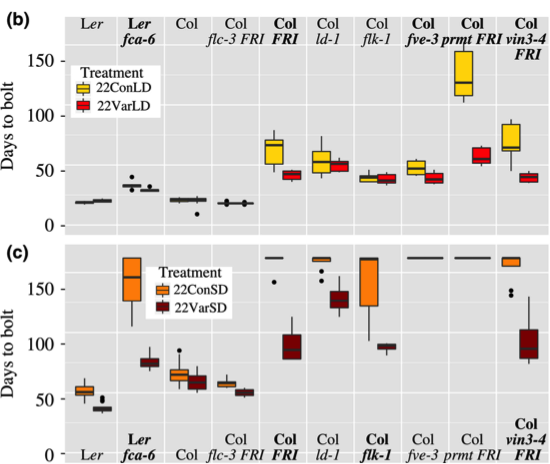

```{r setup, include=FALSE}
knitr::opts_chunk$set(echo = TRUE)
```

# [Retour à la page d'accueil](https://scortijo.github.io/ggplot_course/)

## Formation ggplot2 - solution des exercices

```{r, echo=FALSE, message=FALSE}
library(tidyverse)
expt1 <- read_tsv("../data/burghardt_et_al_2015_expt1.txt")
```


> **Exercice:** Pouvez vous dessiner un violin plot? (indice: ``?geom_violin``)

```{r}
ggplot(expt1, aes(genotype, days.to.flower)) +
  geom_violin()
```

-----------------------

>**Exercice:** Modifiez le graphique pour que les points soient devant plutôt que derrière les boxplots. 

```{r}
ggplot(expt1, aes(genotype, rosette.leaf.num)) +
  geom_boxplot() + 
  geom_jitter()
```

----------------------

>**Exercice:** Nous voulons étudier la relation entre le nombre de feuille de rosette et la longueur la limbe des feuilles (en mm) pour les genotypes. 
>
> Pour cela, dessinez un scatter plot (`geom_point()`) entre `blade.length.mm` et `rosette.leaf.num` en colorant les points en fonction de `genotype`. 
>
> Que se passe t-il si les points sont colorés en fonction de `days.to.bolt`?


```{r}
ggplot(expt1, aes(blade.length.mm, rosette.leaf.num, colour = genotype)) +
  geom_point()
```

L'échelle de couleur est continue si nous utilisons `days.to.bolt` pour colorer les points car c'est une variable numérique:

```{r}
ggplot(expt1, aes(blade.length.mm, rosette.leaf.num, colour = days.to.bolt)) +
  geom_point()
```


---------------------

>**Exercice:** Les couleurs n'apportent plus d'information supplementaire. Pensez à une utilisation plus interessante des couleurs dans ce graphque. 

```{r}
ggplot(expt1, aes(blade.length.mm, rosette.leaf.num, colour = fluctuation)) +
    geom_point() +
    facet_wrap( ~ genotype)
```


------------------------

>**Exercice:** Modifiez le graphiqe précédent afin de séparer les données (facet) en fonction de `fluctuation` en ligne, et `day.length` en colonne et de colorer les points en fonction du génotype.

```{r}
ggplot(expt1, aes(blade.length.mm, rosette.leaf.num, colour = genotype)) +
    geom_point() +
    facet_grid(day.length ~ fluctuation)
```


------------------------

>**Exercice**: Reproduisez le graphique suivant (ou quelque chose d'approchant): 
. 
>
>**Indice**: facet le graphique avec `day.length` et `temperature` et colorer l'intérieur des boxplot en fonction de `fluctuation`.

```{r}
ggplot(expt1, aes(genotype, days.to.bolt, fill = fluctuation)) +
    geom_boxplot() +
    facet_grid(day.length ~ temperature)
```

