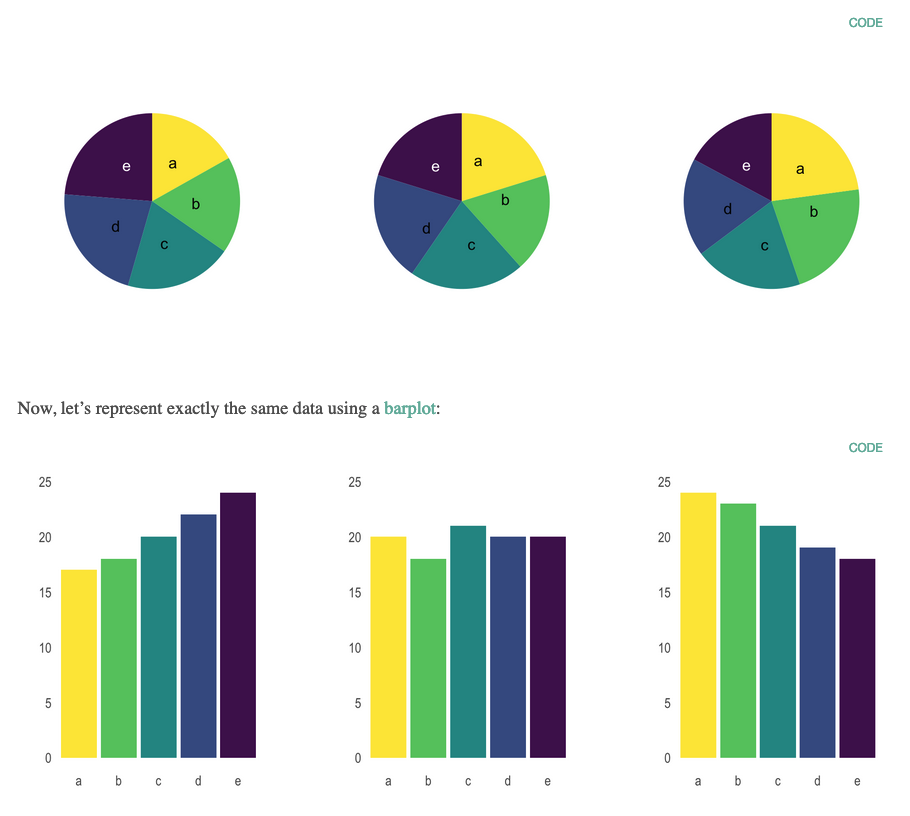

```{r setup, include=FALSE}
knitr::opts_chunk$set(echo = TRUE)
```

[Retour à la page d'accueil](https://scortijo.github.io/2021_L3_R/)


Dans cette seconde partie de la section dédiée à la visualisation de données vous allez:
- Changer l'apparence des graphiques 
- Combiner plusieurs graphiques dans une même figure
- Inclure du dynamisme et de l'interactivité à vos graphique
- Apprendre les meilleures pratique pour visualiser des données


# Mise en place

Avant de rentrer dans le vif du sujet il nous faut mettre en place notre environnement de travail. Créez un nouveau script R et:

- chargez les librairies nécessaires:

```{r load packages, eval = TRUE, message = FALSE}
library(tidyverse)
```

- changer votre répertoire de travail pour être dans le dossier `session3_plots_manipulation`:


``` {r}
setwd("~/Desktop/2021_L3_R/session3_plots_manipulation/")
```

- Importez les données dans R:

```{r read data}
expt1 <- read_tsv("../data/burghardt_et_al_2015_expt1.txt")
```

Nous sommes maintenant prêt!


# Changer l'apparence d'un graphique en utilisant les thèmes

Tous les éléments d'un ggplot sont modifiables. Les **themes** permettent de modifier l'apparence du graphique. Voici quelques exemples. 


```{r warning = FALSE}
# Example de thèmes existants dans ggplot2 
ggplot(expt1, aes(genotype, days.to.flower)) +
  geom_boxplot() +
  theme_bw() +
  labs(title = "Black and white theme")

ggplot(expt1, aes(genotype, days.to.flower)) +
  geom_boxplot() +
  theme_classic() +
  labs(title = "Classic theme")

ggplot(expt1, aes(genotype, days.to.flower)) +
  geom_boxplot() +
  theme_minimal() +
  labs(title = "Minimal theme")
```


La fonction `theme()` peut être utilisée pour modifier des éléments en particulier du graphique. Il y a tellement de possibilités que le mieux est de rechercher sur internet la modification que vous voulez faire.  


Par exemple, en recherchant "vertical labels x axis ggplot2" nous obtenons [cette solution](https://stackoverflow.com/questions/1330989/rotating-and-spacing-axis-labels-in-ggplot2): 

```{r warning = FALSE}
ggplot(expt1, aes(genotype, days.to.flower)) +
  geom_boxplot() +
  theme(axis.text.x = element_text(angle = 90, hjust = 1))
```

Rechercher "altering plot colours ggplot2" donne 
[ceci](http://www.sthda.com/english/wiki/ggplot2-colors-how-to-change-colors-automatically-and-manually), qui apporte cette solution:

```{r warning = FALSE}
ggplot(expt1, aes(genotype, days.to.flower, fill = fluctuation)) +
  geom_boxplot() +
  scale_fill_brewer(palette="Dark2")
```


# Combiner plusieurs graphiques dans une même figure

Parfois nous voulons crée une figure contenant plusieurs graphiques, c'est le cas dans la plupart des articles scientifiques.

Par exemple le graphique que vous avez reproduit hier correspond aux panels B et C d'une figure de [Burghard et al 2015](https://nph.onlinelibrary.wiley.com/doi/full/10.1111/nph.13799)

{width=60%}


<br>


Nous allons faire quelque chose de similaire avec un scatterplot en panel A, et des boxplots en panel B.

Pour cela nous allons utiliser la fonction `ggarrange()` qui est dans le package `ggpubr`.

Tout d'abord, nous devons charger cette librairie dans R:


```{r}
library(ggpubr)
```


Ensuite, faisons chaque graphique indépendamment et sauvons les dans un objet:

- Un scatterplot montrant la relation entre le nombre de feuilles et le nombre de jours jusqu’à floraison, coloré en fonction du traitement: 


```{r}
panelA <- ggplot(expt1, aes(rosette.leaf.num, days.to.bolt, colour = fluctuation)) +
    geom_point() 
```


- Des boxplots du nombre de jours jusqu’à floraison pour les différent génotypes, séparés en fonction de la température, et colorés en fonction du traitement (fluctuation ou non):

```{r}
panelB <- ggplot(expt1, aes(genotype, days.to.bolt, fill = fluctuation)) +
    geom_boxplot() +
    facet_grid(. ~ temperature) +
  theme(axis.text.x = element_text(angle = 90, hjust = 1))
```


Nous pouvons maintenant utiliser la fonction `grid.arrange()` pour combiner les graphiques ensemble:


```{r warning = FALSE}
ggarrange(panelA, panelB, nrow=2, labels =c("A", "B"),heights = c(1.5, 2))
```

# Dynamisme et interactivité

## Créer des graphiques avec des animations

Si nous postons les graphiques en ligne, cela peut apporter un plus d'inclure une animation dans le graphique, à condition que cela apporte des informations supplémentaire. C'est possible avec le package `gganimate`!

Tout d'abord, chargeons le package `gganimate`:


```{r}
library(gganimate)
```

Pour créer une animation, il faut utiliser la fonction `transition_states()` à notre graphique (avec un _+_)


```{r warning=FALSE}
ggplot(expt1, aes(rosette.leaf.num, days.to.bolt, colour = fluctuation)) +
    geom_point()  +
  transition_states(states = genotype, wrap = FALSE, transition_length = 1, state_length = 3) +
  ease_aes('linear') +
  labs(subtitle = "{closest_state}") 

```

L'animation peut ensuite être sauvée en utilisant la fonction anim_save()


## Interactivité!

Pour aller plus loin, il est même possible de créer des graphiques interactifs en utilisant le package  `plotly`.  


```{r include=FALSE}
library(plotly)
```


Il faut d'abord mettre le graphique dans un objet, puis utiliser cet objet dans la fonction `ggplotly()`.


```{r go interactive, warning=FALSE}
# Mettre le graphique dans l'objet p1
p1 <- ggplot(expt1, aes(rosette.leaf.num, days.to.bolt, colour = fluctuation)) + 
  geom_point() +
  facet_wrap(~genotype)

# Utiliser la fonction ggplotly pour faire un graphique intéractif
ggplotly(p1)
```


Plutôt que d'avoir un graphique par génotype, il est possible d’ajouter un curseur pour montrer les données des génotypes de manière interaction en utilisant l'argument 'frame':


```{r  warning=FALSE}
# Mettre le graphique dans l'objet p1
p2 <- ggplot(expt1, aes(rosette.leaf.num, days.to.bolt, colour = fluctuation, frame=genotype)) + 
  geom_point() 

# Utiliser la fonction ggplotly pour faire un graphique intéractif
ggplotly(p2)
```

<br>

# Bonnes pratiques de visualisation de données

### Trouver le graphique approprié à vos données et à votre question

Utiliser le graphique approprié à nos données et répondant à notre question est essentiel. Cependant cela n'est pas toujours intuitif et depend:

- **Du type de données**. S'agit t'il de nombres ou de catégories, ou d'une combinaison des deux? Ou bien de séries chronologique?

-**Du nombre de variable à représenter**. Voulez vous montrer une seule variable ou plusieurs? Et s'il y en a deux, voulez vous les comparer directement (dans le cas de nombres)

Comme il existe de nombreuses options, utiliser [ce guide avec un arbre de décision](https://www.data-to-viz.com/)


> **Discussion de groupe**
>
> Discutez avec votre voisin des deux types de graphique suivant. 
>
> Les avez vous déjà utilisé? Si oui, pour représenter quel type de données?
>
> Sont ils appropriée à vos données et à votre question? Si non, quel autre
> type de graphique utiliseriez vous maintenant que vous savez utiliser ggplot?
>
>
> **1. Le camembert (pie chart)**
>
> Aidez vous de cette figure compararant des camemberts et des barplots montrant les mêmes données 
> {width=70%}
>
>
> **2. Le barplot avec des barrres d'erreur**
>
> Les barplots avec barre d'erreur permettent de représenter la moyenne d'une population (barplot) ainsi que 
> la dispersion des données (barre d'erreur). 
>
> Mais est-ce idéal pour montrer nos données? Discutez en avec votre voisin en vous aidant 
> de la figure ci-dessous extraite de
> [Weissgerber et al., 2015](https://journals.plos.org/plosbiology/article?id=10.1371/journal.pbio.1002128).
>
> {width=70%}
> 
>
>
>
>


### Etre le plus près des données et ne pas cacher ou modifier les données étranges

boxplot, violin plot ou point?

Axes coupés ou qui ne commencent pas à zéro

### Comment faire ressortir le message des données

ordonner les données

Eviter de mettre trop d'info dans un graph

Bien utiliser les couleurs (+ palette daltoniens)


