```{r setup, include=FALSE}
knitr::opts_chunk$set(echo = TRUE)
```

[Retour à la page d'accueil](https://scortijo.github.io/2021_L3_R/)


Dans cette seconde partie de la section dédiée à la visualisation de données vous allez:
- Changer l'apparence des graphiques 
- Combiner plusieurs graphiques dans une même figure
- Inclure du dynamisme et de l'interactivité à vos graphique
- Apprendre les meilleures pratique pour visualiser des données


# Mise en place

Avant de rentrer dans le vif du sujet il nous faut mettre en place notre environnement de travail. Créez un nouveau script R et:

- chargez les librairies nécessaires:

```{r load packages, eval = TRUE, message = FALSE}
library(tidyverse)
```

- changer votre répertoire de travail pour être dans le dossier `session3_plots_manipulation`:


``` {r}
setwd("~/Desktop/2021_L3_R/session3_plots_manipulation/")
```

- Importez les données dans R:

```{r read data}
expt1 <- read_tsv("../data/burghardt_et_al_2015_expt1.txt")
```

Nous sommes maintenant prêt!


# Changer l'apparence d'un graphique en utilisant les thèmes

Tous les éléments d'un ggplot sont modifiables. Les **thèmes** permettent de modifier l'apparence du graphique. Voici quelques exemples. 


```{r warning = FALSE}
# Example de thèmes existants dans ggplot2 
ggplot(expt1, aes(genotype, days.to.flower)) +
  geom_boxplot() +
  theme_bw() +
  labs(title = "Black and white theme")

ggplot(expt1, aes(genotype, days.to.flower)) +
  geom_boxplot() +
  theme_classic() +
  labs(title = "Classic theme")

ggplot(expt1, aes(genotype, days.to.flower)) +
  geom_boxplot() +
  theme_minimal() +
  labs(title = "Minimal theme")
```


La fonction `theme()` peut être utilisée pour modifier des éléments en particulier du graphique. Il y a tellement de possibilités que le mieux est de rechercher sur internet la modification que vous voulez faire.  


Par exemple, en recherchant "vertical labels x axis ggplot2" nous obtenons [cette solution](https://stackoverflow.com/questions/1330989/rotating-and-spacing-axis-labels-in-ggplot2): 

```{r warning = FALSE}
ggplot(expt1, aes(genotype, days.to.flower)) +
  geom_boxplot() +
  theme(axis.text.x = element_text(angle = 90, hjust = 1))
```

Rechercher "altering plot colours ggplot2" donne 
[ceci](http://www.sthda.com/english/wiki/ggplot2-colors-how-to-change-colors-automatically-and-manually), qui apporte cette solution:

```{r warning = FALSE}
ggplot(expt1, aes(genotype, days.to.flower, fill = fluctuation)) +
  geom_boxplot() +
  scale_fill_brewer(palette="Dark2")
```


# Combiner plusieurs graphiques dans une même figure

Parfois nous voulons crée une figure contenant plusieurs graphiques, c'est le cas dans la plupart des articles scientifiques.

Par exemple le graphique que vous avez reproduit hier correspond aux panels B et C d'une figure de [Burghard et al 2015](https://nph.onlinelibrary.wiley.com/doi/full/10.1111/nph.13799)

{width=60%}


<br>


Nous allons faire quelque chose de similaire avec un scatterplot en panel A, et des boxplots en panel B.

Pour cela nous allons utiliser la fonction `ggarrange()` qui est dans le package `ggpubr`.

Tout d'abord, nous devons charger cette librairie dans R:


```{r}
library(ggpubr)
```


Ensuite, faisons chaque graphique indépendamment et sauvons les dans un objet:

- Un scatterplot montrant la relation entre le nombre de feuilles et le nombre de jours jusqu’à floraison, coloré en fonction du traitement: 


```{r}
panelA <- ggplot(expt1, aes(rosette.leaf.num, days.to.bolt, colour = fluctuation)) +
    geom_point() 
```


- Des boxplots du nombre de jours jusqu’à floraison pour les différent génotypes, séparés en fonction de la température, et colorés en fonction du traitement (fluctuation ou non):

```{r}
panelB <- ggplot(expt1, aes(genotype, days.to.bolt, fill = fluctuation)) +
    geom_boxplot() +
    facet_grid(. ~ temperature) +
  theme(axis.text.x = element_text(angle = 90, hjust = 1))
```


Nous pouvons maintenant utiliser la fonction `grid.arrange()` pour combiner les graphiques ensemble:


```{r warning = FALSE}
ggarrange(panelA, panelB, nrow=2, labels =c("A", "B"),heights = c(1.5, 2))
```

# Dynamisme et interactivité

## Créer des graphiques avec des animations

Si nous postons les graphiques en ligne, cela peut apporter un plus d'inclure une animation dans le graphique, à condition que cela apporte des informations supplémentaire. C'est possible avec le package `gganimate`!

Tout d'abord, chargeons le package `gganimate`:


```{r}
library(gganimate)
```

Pour créer une animation, il faut utiliser la fonction `transition_states()` à notre graphique (avec un _+_)


```{r warning=FALSE}
ggplot(expt1, aes(rosette.leaf.num, days.to.bolt, colour = fluctuation)) +
    geom_point()  +
  transition_states(states = genotype, wrap = FALSE, transition_length = 1, state_length = 3) +
  ease_aes('linear') +
  labs(subtitle = "{closest_state}") 

```

L'animation peut ensuite être sauvée en utilisant la fonction anim_save()


## Interactivité

Pour aller plus loin, il est même possible de créer des graphiques interactifs en utilisant le package  `plotly`.  


```{r message=FALSE}
library(plotly)
```


Il faut d'abord mettre le graphique dans un objet, puis utiliser cet objet dans la fonction `ggplotly()`.


```{r go interactive, warning=FALSE}
# Mettre le graphique dans l'objet p1
p1 <- ggplot(expt1, aes(rosette.leaf.num, days.to.bolt, colour = fluctuation)) + 
  geom_point() +
  facet_wrap(~genotype)

# Utiliser la fonction ggplotly pour faire un graphique intéractif
ggplotly(p1)
```


Plutôt que d'avoir un graphique par génotype, il est possible d’ajouter un curseur pour montrer les données des génotypes de manière interaction en utilisant l'argument 'frame':


```{r  warning=FALSE}
# Mettre le graphique dans l'objet p1
p2 <- ggplot(expt1, aes(rosette.leaf.num, days.to.bolt, colour = fluctuation, frame=genotype)) + 
  geom_point() 

# Utiliser la fonction ggplotly pour faire un graphique intéractif
ggplotly(p2)
```

<br>

# Bonnes pratiques de visualisation de données

<br>

## Trouver le graphique approprié à vos données et à votre question

Utiliser le graphique approprié à nos données et répondant à notre question est essentiel. Cependant cela n'est pas toujours intuitif et dépend:

- **Du type de données**. S'agit t-il de nombres ou de catégories, ou d'une combinaison des deux? Ou bien de séries chronologique?

-**Du nombre de variable à représenter**. Voulez vous montrer une seule variable ou plusieurs? Et s'il y en a deux, voulez vous les comparer directement (dans le cas de nombres)

Comme il existe de nombreuses options, utilisez [ce guide avec un arbre de décision](https://www.data-to-viz.com/) pour choisir la meilleure méthode de visualisation


> **Discussion de groupe**
>
> Discutez avec votre voisin des deux types de graphique suivant. 
>
> Les avez vous déjà utilisé? Si oui, pour représenter quel type de données?
>
> Sont ils appropriée à vos données et à votre question? Si non, quel autre
> type de graphique utiliseriez vous maintenant que vous savez utiliser ggplot?
>
>
> <br>
>
> **1. Le camembert (pie chart)**
>
> Aidez vous de cette figure comparant des camemberts et des barplots 
> montrant les mêmes données 
> 
> {width=70%} 
> 
> [source de l'image](https://www.data-to-viz.com/caveat/pie.html)
>
> **2. Le barplot avec des barres d'erreur**
>
> Les barplots avec barre d'erreur permettent de représenter la moyenne d'une population (barplot) ainsi que 
> la dispersion des données (barre d'erreur). 
>
> Mais est-ce idéal pour montrer nos données? Discutez en avec votre voisin en vous aidant 
> de la figure ci-dessous extraite de
> [Weissgerber et al., 2015](https://journals.plos.org/plosbiology/article?id=10.1371/journal.pbio.1002128).
>
> {width=70%} 
> 


## Etre le plus près des données et ne pas cacher ou modifier les données étranges

De manière générale il est recommandé d'être au plus près des données quand nous réalisons des graphiques.
- Choisissez de présenter toutes vos données, sans les modifier ou en supprimer une partie (si vous le faites, vous devez expliquer ce que vous avez fait et pourquoi). 

- Idéalement, et si cela se prête à votre question, montrez les données plutôt que des résumés. Choisissez des nuages de points plutôt que des barplots avec des barres d'erreur. 

- Toujours indiquer la taille des effectifs, soit en l'écrivant dans le graphique, soit en le rendant visible (nuage de point, densité etc)

Pour aller plus loin, nous allons regarder de plus prêt deux cas en particulier:

#### 1. Comparer des distributions

Pour rappel, le boxplot permet de montrer un bon résumé des données:
{width=70%} 

[source de l'image](https://www.leansigmacorporation.com/box-plot-with-minitab/)


Cependant, faire un résumé des données peut cacher des informations:

- effectifs de différente taille dans certains groupes
- distribution unimodale vs bimodale

<br>

Des alternatives existent pour représenter les données, afin d'éviter ces problèmes:

- Si vous n'avez pas trop de points, vous pouvez les représenter au dessus des boxplots:
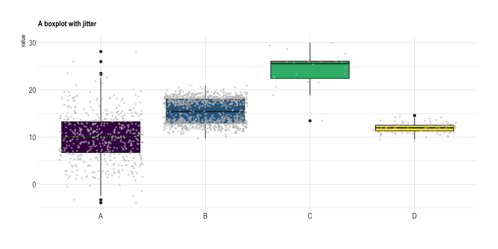{width=70%} 

[source de l'image](https://www.data-to-viz.com/caveat/boxplot.html)

- Si vous avez trop de points pour les représenter dans le graphique, vous pouvez utiliser un violin plot  en indiquant la taille de l'effectif de chaque groupe:
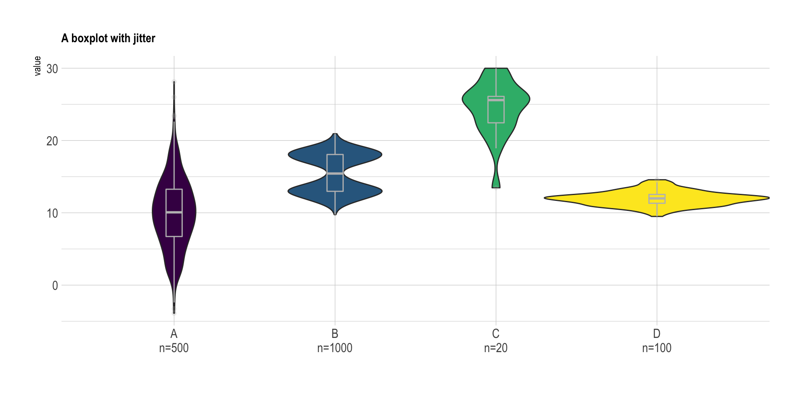{width=70%} 

[source de l'image](https://www.data-to-viz.com/caveat/boxplot.html)

#### 2. Axes coupés ou non?

Si vous avez des données numériques avec des valeurs très éloignées de zéro il peut être tentant de ne pas faire commencer l'axe y à zéro mais plus proche de vos valeurs. Attention, cela peut cependant changer la conclusion!

Voici un exemple avec deux graphiques, l'un avec l'axe des y commençant à zéro et l'autre non. Le deuxième peut donner l'impression qu'il y a une grande différence entre les deux groupes, même si ce n'est pas forcement le cas.


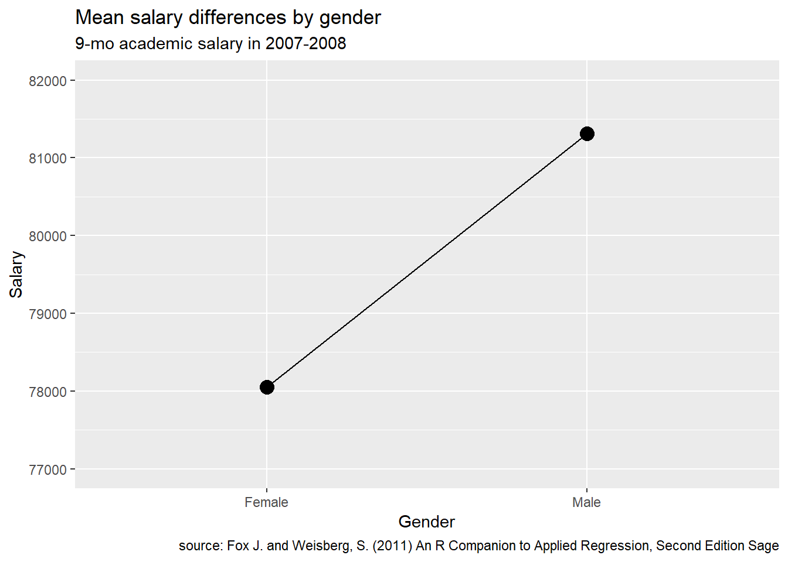{width=70%} 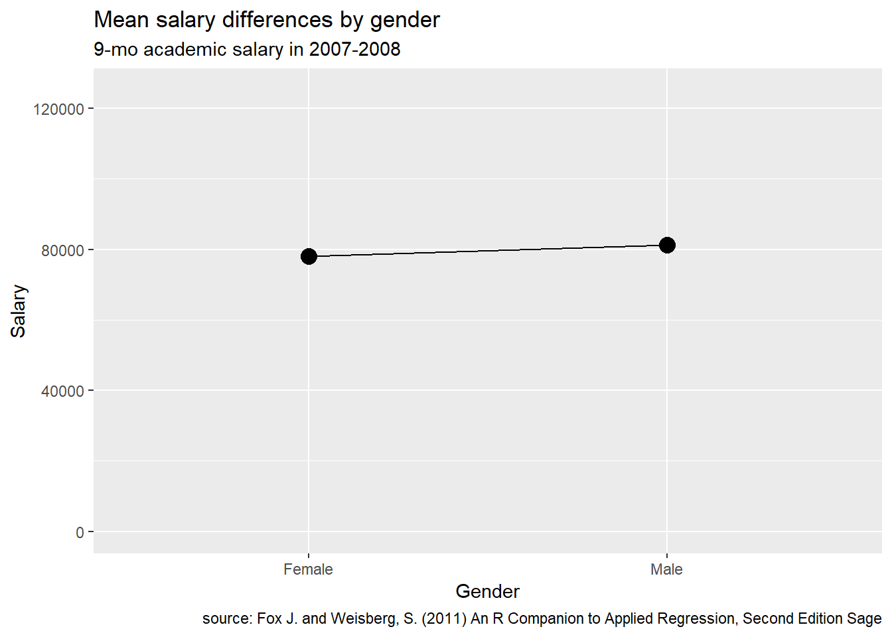{width=70%}

[source des images](https://rkabacoff.github.io/datavis/Advice.html)


De manière générale:
- Si vous utilisez des barplot ou des points avec différentes catégories à comparer, faites commencer l'axe y à zéro.
- Si vous utilisez des lignes (comme dans le cas de séries chronologiques), il n'est pas nécessaire de faire commencer l'axe des y à zéro. En effet ce type de graphique permet de montrer l'évolution d'une observation par exemple au cours du temps. Alors que les barplots sont utilisés pour montrer la différence entre deux (ou plusieurs) groupes


<br>

Si vous avez des données numériques avec certains points très éloignés des autres il peut être tentant de couper l'axe y entre les groupes de points. Ne le faites jamais!! Il existe d'autres alternatives comme par exemple utiliser une échelle logarithmique. 


## Comment bien faire ressortir le message des graphiques

Maintenant que nous avons vu les erreurs à éviter quand nous créons des graphique, passons aux méthodes permettant de bien faire ressortir le message des graphiques. Cela permettra de faciliter l'interprétation des graphique. 

De manière générale, évitez de faire des graphiques trop compliqués avec des fioritures. Évitez la 3D, les axes doubles et les lignes de grille. Concentrez vous sur l'essentiel! 

Voyons trois méthodes plus en détail:


#### 1. Ordonnez les données

Par défaut, R va ordonner les catégories de vos variable par ordre alphabétique. Sur excel, l'ordre des variable dans le tableau est utilisé. Cependant cet ordre n'est pas toujours optimal.

Vous pouvez changer l'ordre des catégories de vos variable sur R (nous verrons comment en séance 5). Voici quelques conseils pour bien choisir l’ordre dans lequel représenter les données.

- Si vous comparez des données pour un (ou des) mutant à un wild type, ou si vous comparez un (ou plusieurs) traitement à un contrôle, **commencez toujours par la référence**, c.a.d le wild type ou le contrôle.

- S'il n'y a pas de référence (wild type ou contrôle) et que vous voulez comparer différents conditions, dans ce cas **ordonnez vos catégories en fonction de leur valeur**, par exemple du plus grand au plus petit. Cela permettra facilement d'identifier les catégories avec les valeurs les plus grandes ou plus petites, ou les catégories avec des valeurs similaires.
Voici un exemple d'un graphique avec des catégories non ordonnées, puis avec des catégories ordonnées. La version avec les catégories ordonnées est beaucoup plus facile à interpréter.


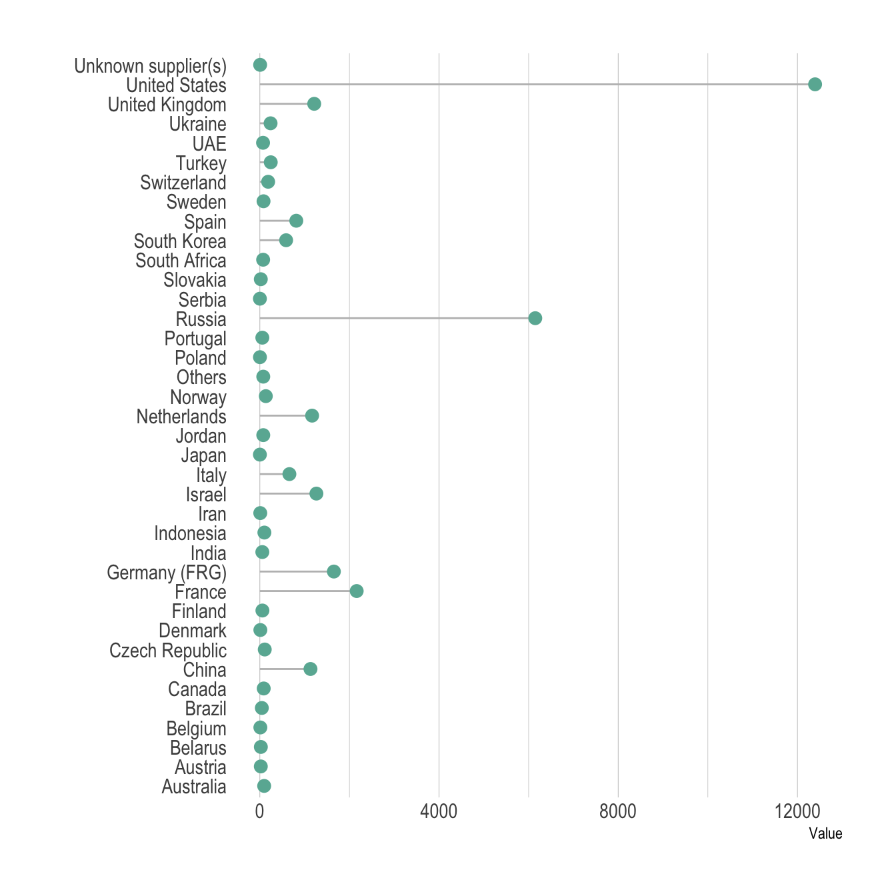{width=60%}
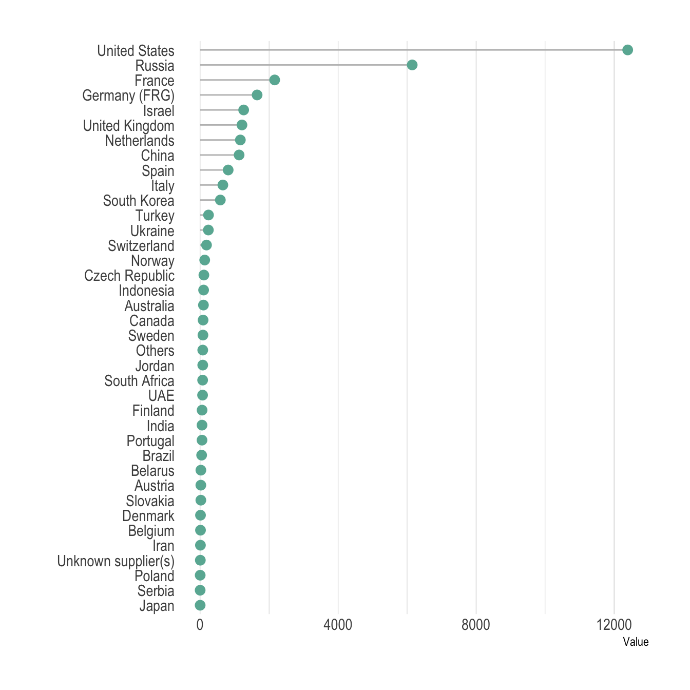{width=60%}


[source des images](https://www.data-to-viz.com/caveat/order_data.html)


#### 2. Évitez de mettre trop d'information dans vos graphiques

Il est tentant de vouloir faire rentrer toutes vos données dans un même graphique, surtout qu'avec R vous pouvez jouer avec les couleurs, les formes et la taille des points. Mais pour que le message ressorte bien, il vaut mieux présenter moins de données et se concentrer sur **un message par graphique**. 


- Pour des graphiques avec des lignes, montrer plus de quelques (5?) lignes peut rendre le graphique illisible. Sauf si vous voulez montrer que toutes les lignes se comportent de la même manière.

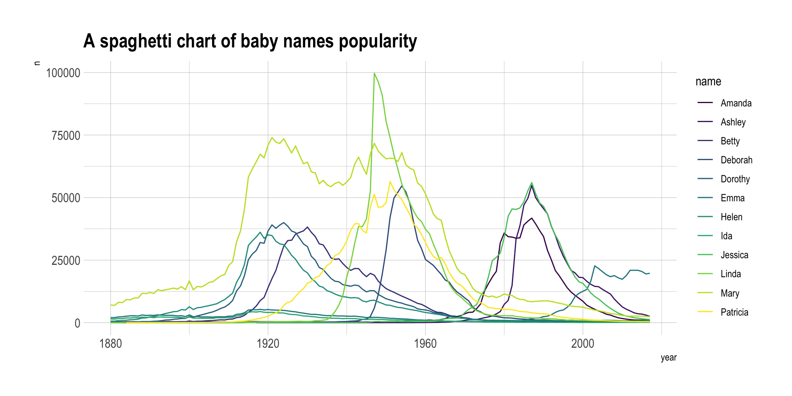{width=90%}

Pour éviter ce problème, vous pouvez faire un graphique par ligne, ou mettre en valeur une ligne en particulier.

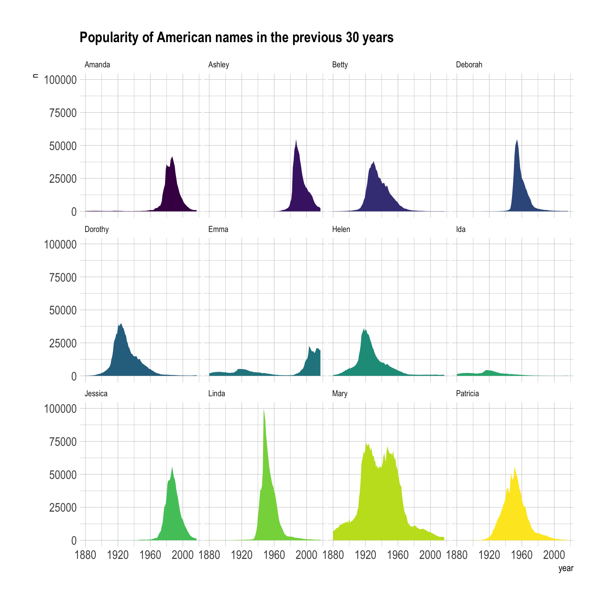{width=60%}
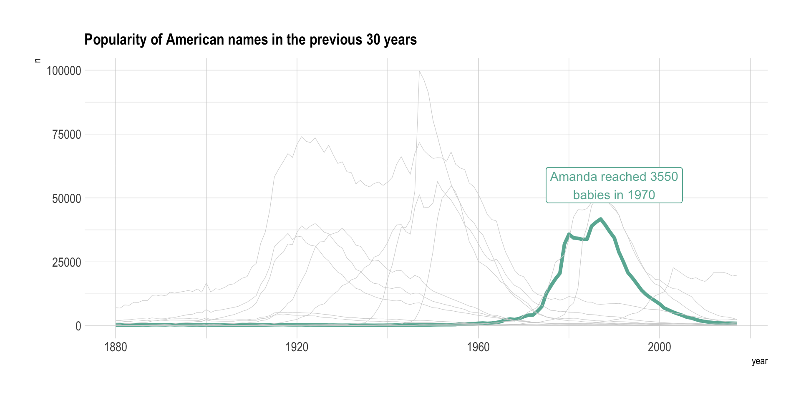{width=80%}

[source des images](https://www.data-to-viz.com/caveat/spaghetti.html)


- Pour les graphiques avec des points, si vous avez trop de points il est difficile de bien l'interpréter. 


Pour inclure l'information de la densité en points vous pouvez utiliser la transparence des points, ou montrer la densité en 2D ou 3D

Graphique avec trop de points cachant la densité

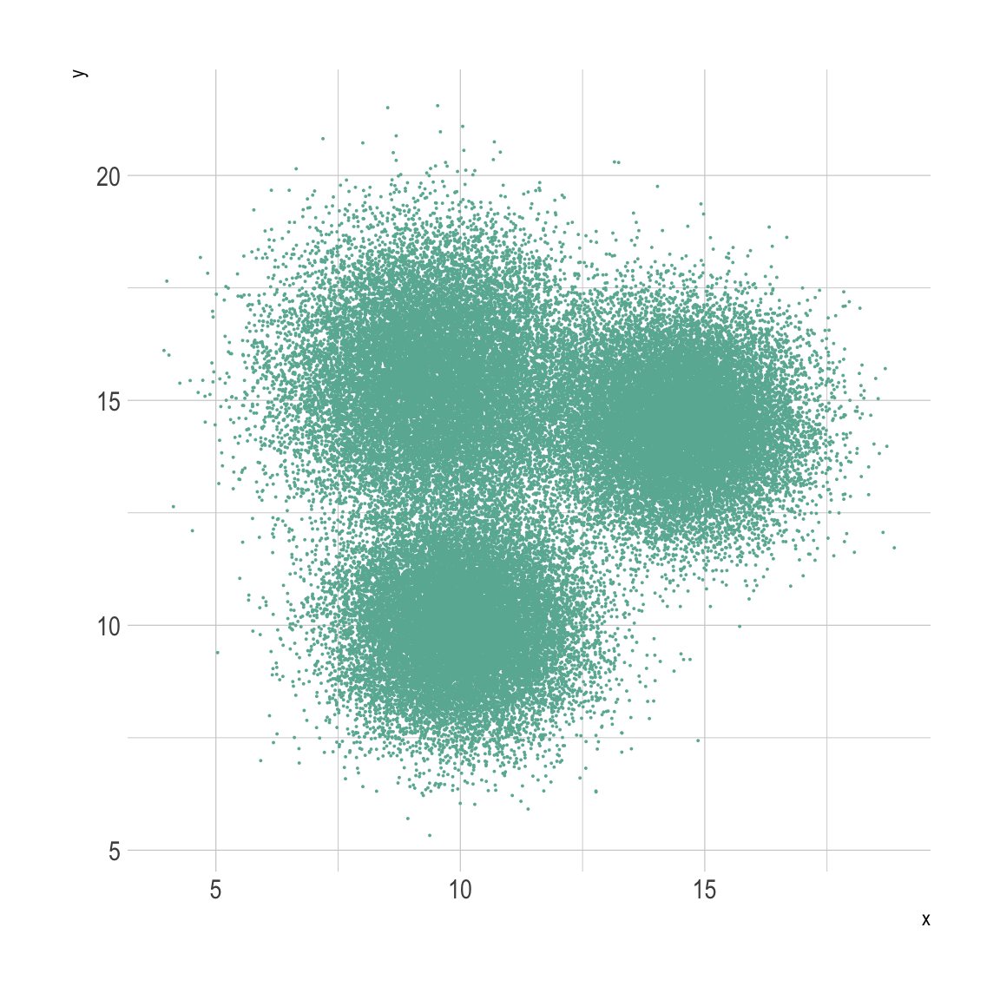{width=50%}

Graphique avec une densité 2D

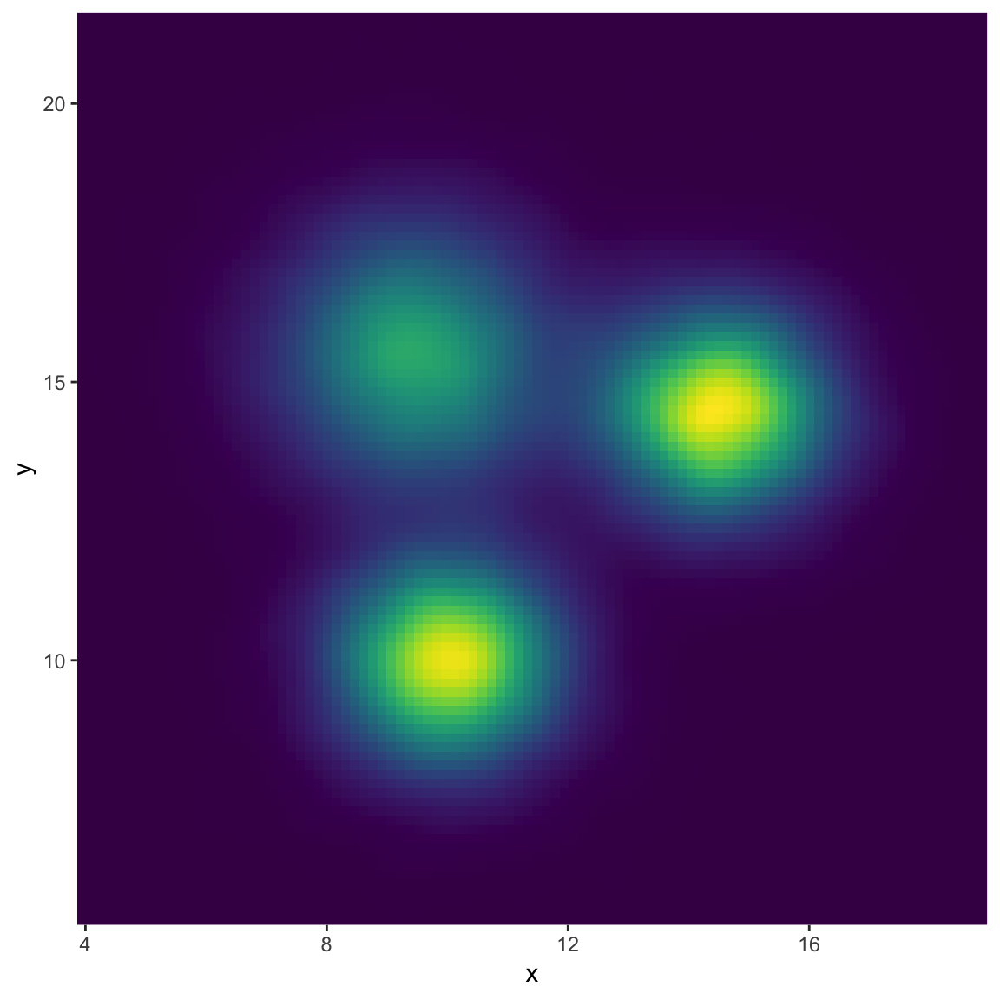{width=50%}

Graphique avec une densité 3D

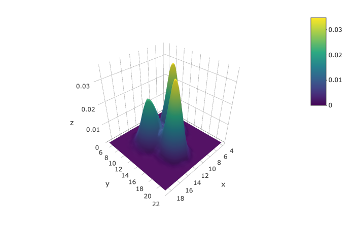{width=60%}

[source des images](https://www.data-to-viz.com/caveat/overplotting.html)


#### 3. Bien utiliser les couleurs 

Un avantage de ggplot est qu'il offre une large palette de couleur. 
Il existe d'ailleurs la libraire `RColorBrewer` qui contient de nombreuses palettes prédéfinies qui vous aideront beaucoup. 

```{r  echo=FALSE, message=FALSE, warning=FALSE}

library(RColorBrewer)

```

Voici toutes les palettes de couleur de `RColorBrewer`


```{r  echo=FALSE, message=FALSE, warning=FALSE}

display.brewer.all()

```


Surtout vous pouvez facilement y sélectionner les palettes de couleurs qui sont aussi visible pour les daltoniens avec la commande:


```{r  }

display.brewer.all(colorblindFriendly = TRUE)

```


Maintenant que nous avons accès à toutes ces couleurs, encore faut-il bien les utiliser. 

> **Discussion de groupe**
>
> Discutez avec votre voisin des graphiques suivant. 
>
> A votre avis, lesquels font une bonne ou une mauvaise utilisation des couleurs? Pourquoi?
> (chaque exemple contient 2 graphiques)
>
> Exemple 1
> 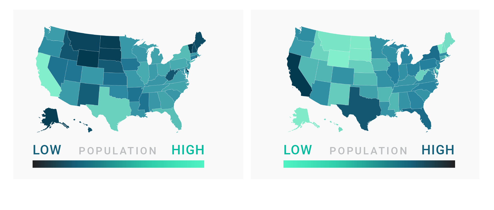
>
> Exemple2
> 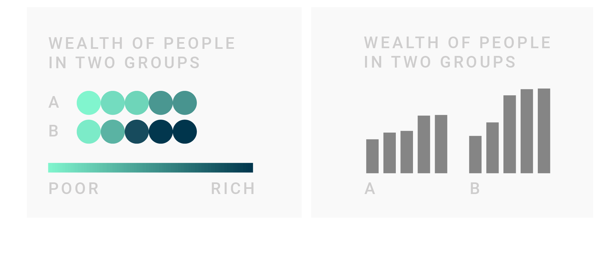
>
> Exemple 3
> 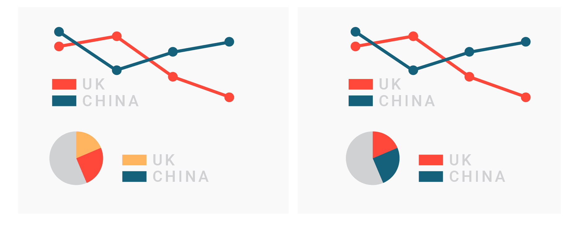
>
> [source des graphiques](https://blog.datawrapper.de/colors/)


Voici quelques conseils pour que la couleur dans les graphiques soit votre allié et non l'inverse.

- **N'utilisez des couleurs que si cela est nécessaire** au graphique et ajoute des informations. Sinon cela va juste créer une distraction et compliquer le graphique. Vous pouvez utiliser des couleurs pour représenter différents groupes, montrer un gradient ou insister sur certains points.
De même ne colorez pas le fond des graphiques.

- **N'utilisez pas plus de 7 couleurs dans un graphique**, sinon cela va créer de la confusion. Dans ce cas, choisissez un autre type de graphique qui permet de réduire le nombre de couleurs utilisées.

- Si vous avez plusieurs graphiques qui contiennent les même variables, **soyez cohérent** et utilisez toujours les même couleurs pour ces variables.

- **Assurez vous d'avoir une légende** qui indique à quoi correspondent les couleurs et mettez la au même endroit pour tous vos graphiques.

- Si vous avez des données moins importantes dans un graphique, colorez les en gris et n'utilisez de la couleur pour les données que vous voulez faire ressortir. 

- Assurez vous qu'il y a assez de contraste entre vos couleurs dans un graphique. Et aussi entre le texte et le fond pour que le texte soit bien lisible.

- **Certaines couleurs sont associées à des idées dans notre culture**. Par exemple le rouge pour _non_ ou _mauvais_ et le vert pour _oui_ ou _bon_. Allez dans ce sens pour rendre vos graphiques plus facile à lire. 

- Si vous utilisez un gradient, **associez les couleurs claires aux faibles valeurs et les couleurs foncées aux valeurs élevées**. Par contre n'utilisez pas de gradients de couleurs pour des catégories, gardez les pour des valeurs numériques.

Vous pouvez trouver des exemples de chaque cas et quelques points supplémentaires [ici](https://blog.datawrapper.de/colors/)


# Ressources et liens utiles

- [Aide au choix du type de graphique](https://www.data-to-viz.com/)
- [Les erreurs à éviter lors de la création de graphiques](https://www.data-to-viz.com/caveats.html)
- [Antisèche pour faire des graphiques intéractifs](https://images.plot.ly/plotly-documentation/images/r_cheat_sheet.pdf)


-------

[Retour à la page d'accueil](https://scortijo.github.io/2021_L3_R/)

