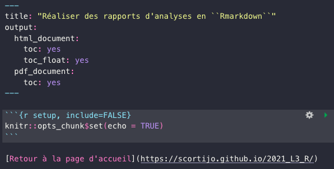
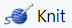
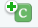

```{r setup, include=FALSE}
knitr::opts_chunk$set(echo = TRUE)
```

[Retour à la page d'accueil](https://scortijo.github.io/2021_L3_R/)

# Introduction à ``Rmarkdown``

Lors de cette séance nous allons apprendre à rédiger des rapports d'analyse en ``Rmarkdown``. L'idée n'est plus de produire de simples scripts (des documents en ``.R`` comme jusqu'à présent), mais **des documents partageables et lisibles par tout le monde**, y compris les personnes ne sachant pas programmer en R. Ces documents contiendront des explications, du contexte, vos lignes de code R, et leurs sorties (les graphiques générés par exemple). 

Plus précisément, [Rmarkdown](http://rmarkdown.rstudio.com) est une syntaxe permettant la rédaction de documents HTML, PDF, MS World, ou d'autres formats.
Il est possible d'y inclure du code R comme dans un script classique, mais également ses sorties, et en les encapsulant dans un rapport en structuré et fourni en descriptions, interprétations textuelles, liens, images...


<center></center>


Nous allons illustrer les possibilités offertes par ce langage en faisant une courte analyse en R des données de Burghardt et Al. (2015), et en exportant ces analyses sous forme d'un rapport complet et documenté.


## Pourquoi utliliser du Rmarkdown?

+ Ce format permet la **communication** de méthodes et de résultats de manière claire et commentée, particulièrement à des non spécialistes de l'informatique ou des statistiques.

+ La **reproductibilité** des analyses est garantie, car le code ayant généré les résultats montrés est présent, et peut être réexécuté par toute personne possédant le document.

En résumé, ce format favorise l'intégrité scientifique des travaux de recherche impliquant du code R.

<center></center>

## Structure d'un document et fonctionnement

Un document ``Rmarkdown`` comprend 3 types de contenu : 

+ Une **entête** au format YAML (Yet Another Markup Langage), au tout début du document, qui donne les paramètres du document (type de format (pdf, HTML), l'auteur, la date, le thème, un fichier de bibliographie...). Il est entouré des délimiteurs ``---`` .

+ Des morceaux de code appelés **chunks**, dans lesquels le code R est placé et peut être exécuté. 


+ Des parties rédigées avec la syntaxe **markdown**. Il s'agit de texte enrichi de titres, sous titres, listes, insertion d'images, de liens, etc. Une description de cette syntaxe est également disponible dans la [documentation](https://rstudio.com/wp-content/uploads/2015/03/rmarkdown-reference.pdf?_ga=2.116494478.901299713.1598125979-1765392125.1580035352). De plus, la [syntaxe Latex](https://en.wikibooks.org/wiki/LaTeX/Mathematics) peut être utilisée pour faire le rendu d'équations mathématiques.

Vous avez ci-dessous un aperçu de ces trois composants, c'est à dire une entête, un chunk de code R, et une partie textuelle en markdown : 



La syntaxe complète de Rmarkdown, dont vous allez avoir besoin par la suite, est dans cette [antisèche](https://www.rstudio.com/wp-content/uploads/2015/02/rmarkdown-cheatsheet.pdf), que vous pouvez garder ouverte au cours du TP.


# Mise en place

## Création du document

Ouvrez `Rstudio`. Nous allons créer un nouveau document ``Rmarkdown``. Dans la séance d'aujourd'hui, nous allons nous consacrer sur la création de rapports de type HTML (permettant de l’interactivité contrairement aux PDFs). Pour ceci, dans le menu haut de Rstudio, choisissez Fichier/Nouveau fichier/R markdown, acceptez et laissez les valeurs par défaut.

Comme vous le constatez, `RStudio` propose déjà un petit exemple fonctionnel de document ``Rmarkdown``. Sauvegardez le dans le répertoire `session5_rmarkdown/materiel`. Remarquez l'extension du fichier, `.Rmd`, qui diffère des `.R` des séances précédentes.

Pour créer le document HTML à partir du script ouvert dans `RStudio`, on utilise le bouton  (ou le raccourci clavier `Ctrl+Maj+K`). Le logiciel `knitr` est alors utilisé pour créer un document contenant le code et ses sorties, avec le reste du texte, puis le logiciel `pandoc` se charge de donner au document son format et apparence finale (HTML, PDF...). 


## Prise en main

> **Challenge** Compilez votre document avec le bouton Knit. Inspectez le résultat obtenu, ainsi que le code l'ayant généré. Repérez dans votre script quelles sont les parties qui correspondent à l'entête, aux chunks, et à du markdown.

Personnalisez l'entête YAML pour y ajouter votre nom, la date, et le titre du document. Compilez avec **Knit** (ou le raccourci clavier `Ctrl+Maj+K`), pour vérifier que cela a bien modifié le nom d'auteur, le titre, et la date dans le document HTML.

> **Challenge** A votre avis, comment faut-il modifier le document pour avoir un document compilé en PDF et non HTML? (Vous pouvez faire cette modification, compiler pour voir la différence sur le fichier compilé, mais revenez sur du HTML pour la suite du TP).


Observez la première ligne du premier chunk de code. Un chunk prend en option le langage utilisé (`r`), un nom éventuel (ici `setup`), ainsi qu'un certain nombre de paramètres. Par example, ```include = FALSE``` ne fait pas apparaître le code ni les résultats dans le document fini. ```echo = FALSE``` montre les sorties du code mais pas le code lui même. 
Cela explique pourquoi on ne voit pas le contenu du premier chunk de code dans le document compilé. Toutes les options de chunks sont décrites dans la [documentation de Rmarkdown](https://rstudio.com/wp-content/uploads/2015/03/rmarkdown-reference.pdf?_ga=2.116494478.901299713.1598125979-1765392125.1580035352).

Le premier chunk doit être conservé. Sa fonction `knitr::opts_chunk$set` permet de configurer des options communes aux chunks du document. En l'occurrence, par défaut, cette fonction impose ```echo = TRUE``` pour tous les chunks du document. Cela fera apparaître dans le document compilé le code ayant généré l'output (à part si vous spécifiez explicitement le contraire dans les options d'un chunk en particulier).

Dans ce premier chunk, à la suite de l'appel à la fonction`knitr::opts_chunk$set`, rajoutez en code R l'import des packages que nous allons utiliser: ``"tidyverse", "plotly", "DT"``. Exécutez le chunk, au moyen de la petite flèche verte en haut à droite du chunk, ou avec `Ctrl+Shift+Enter`.


Vous pouvez ensuite supprimer la suite du document (l'exemple fourni par défaut), car nous allons remplir le document de nos propres analyses.


> **Attention** N'essayez pas dans la suite du TP de changer le répertoire du travail avec `setwd()`, car dans les documents Rmarkdown, le répertoire de travail est toujours le répertoire dans lequel le document Rmarkdown est enregistré. A l'avenir, nous nous déplacerons toujours de manière relative à ce répertoire là.

# Créer une section de contexte en `markdown`

A la suite du premier chunk, créez une première section nommée "Contexte" comme suit :`# Contexte`.

L'opérateur `#` permet d'indiquer un titre. Pour un sous titre, `##` peut être utilisé.

Décrivez ensuite la publication et les données que nous allons utiliser. Vous pouvez rappeler les auteurs, le titre de la publication, citez des phrases de l'abstract ou de la publication si cela vous paraît pertinent.

Compilez pour vous assurer que votre section apparaît dans le document HTML.


## Inclure un lien vers une ressource en ligne


Nous voulons ajouter un lien pointant vers la publication que nous utilisons. Pour cela, la syntaxe markdown est la suivante ```[Label de votre lien clickable](url de la référence en ligne)```. 

Pour obtenir le résultat suivant :
Les données analysées sont issues d'une [publication intitulée "Fluctuating, warm temperatures decrease the effect of a key floral repressor on flowering time in Arabidopsis thaliana"](https://nph.onlinelibrary.wiley.com/doi/10.1111/nph.13799).

Il vous faut écrire dans la syntaxe markdown les lignes suivantes :

```{}
Les données analysées sont issues d'une [publication intitulée "Fluctuating, warm temperatures decrease the effect of a key floral repressor on flowering time in Arabidopsis thaliana"](https://nph.onlinelibrary.wiley.com/doi/10.1111/nph.13799)
```


Ajoutez ce lien à votre section de contexte et recompilez.

## Mise en italique/gras

Les noms d'espèces végétales comme *Arabidopsis thaliana* doivent être écrits en italique. L'opérateur `*` placé de chaque côté des mots désirés permet de mettre du texte en l'italique. Ajoutez le nom de l'organisme étudié à votre contexte (si ce n'est pas déjà fait), et placez-le en italique.

> **Challenge** Comment mettre des mots en gras? (Indice: parcourez la [documentation de  Rmakdown](https://www.rstudio.com/wp-content/uploads/2015/03/rmarkdown-reference.pdf?_ga=2.116494478.901299713.1598125979-1765392125.1580035352))


## Ajouter une image


Pour illustrer le sujet d'étude, on se propose d'inclure un image de fleurs d'Arabidopsis. De manière très similaire à l'ajout de lien, ajouter une image peut être fait avec la syntaxe ```[Label de votre image](url de l'image en ligne)```. Par exemple, les lignes ce dessous importent une image de fleurs d'Arabidopsis, et citent en dessous la source avec un lien. Utilisez ces lignes pour ajouter l'image proposée.


```{}


[Source de l'image](https://www.researchgate.net/publication/7876365_Molecular_genetic_analyses_of_microsporogenesis_and_microgametogenesis_in_flowering_plants)
```


> **Challenge** Si vous le souhaitez, choisissez une autre image en lien avec le sujet (comme une figure de l'article) et remplacez l'image précédente par votre nouvelle image (n'oubliez pas de mettre à jour la source également).

# Import et affichage des données avec `datatable`

Créez maintenant une nouvelle section intitulée "Analyse de la floraison", et une sous-section "Import et affichage des données".
Créez un nouveau chunk ( `avec Ctrl + Alt + I`, ou sous OS X: `Cmd + Option + I`, ou avec le bouton de l'interface ). A l'intérieur, importez le jeu de données `session5_rmarkdown/data/burghardt_et_al_2015_expt1.txt` comme appris dans les séances précédantes, avec une fonction adaptée au type du fichier (attention, vous devez naviguer jusqu'au fichier de données depuis le répertoire de travail, qui est le répertoire qui contient votre document Rmarkdown).

Exécutez le chunk. Vous devriez voir apparaître en dessous un aperçu de la sortie de la fonction d'import des données si elle retourne des messages. Si vous ne souhaitez pas voir apparaître ces messages dans le document compilé, donnez un argument au chunk afin de supprimer les messages générés par le code R : `message=FALSE`. Recompilez pour vérifier le résultat.

> **Challenge** Supprimez également les messages du chunk de setup relatifs à l'import des libraries

Nous souhaitons maintenant montrer les données brutes au lecteur du rapport. Dans le chunk d'import des données, vous pouvez appliquer les fonctions que vous souhaitez pour inspecter les données, comme vu dans les séances précédantes (pour avoir un aperçu des stypes de données contenus dans le dataframe, par exemple).

Nous aimerions maintenant exposer les données brutes au lecteur du rapport.
Affichez les données de manière simple, en écrivant dans le chunk :

```{r, eval=FALSE}
expt1
```

(``expt1` étant le nom de la variable contenant les données)


Compilez. Vous devriez voir les données (en partie), mais elles ne sont pas présentées en entier, ni d'une manière très agréable à lire.

L'interactivité des rapports HTML permet d'inclure au rapport des tables de données interactives, grâce au package `DT` et sa fonction `datatable`. Remplacez l'affichage précédent par un appel à `datatable` comme suit et observez le résultat dans le document compilé:

```{r, eval=FALSE}
datatable(expt1, filter="top", options = list(pageLength = 10, scrollX=T))
```


L'option `pageLength` permet d'afficher 10 lignes des données par page de tableau, et `scrollX=T` permet à la table interactive de ne pas dépasser la largeur maximale du document.

> **Challenge** Dans le document compilé, parcourez les données, et testez le filtre pour les variables quantitatives, permis par `filter="top"`.


# Intégration de graphiques `ggplot` au rapport

## Création d'un graphique

Nous allons maintenant réaliser une visualisation des données de floraison. Créez une sous-section "Visualisation des données de floraison". Annoncez en markdown dans cette sous-sectoin que vous allez retirer les valeurs manquantes, et faites-le dans un chunk au dessous. 

Puis, décrivez la visualisation que vous souhaitez faire. Ici, nous allons montrer le nombre de feuilles des rosettes (variable `rosette.leaf.num`) en fonction du nombre de jours jusqu'à floraison (variable `days.to.flower`), et séparer les observations par une couleur correspondant à la photopériode (variable `day.length`). Réalisez ce graphe avec `ggplot2` (n'oubliez pas de lui donner un titre) dans un nouveau chunk.


Compilez et observez le résultat.


En dessous du chunk permettant de générer le graphe, interprétez la visualisation. Comment le nombre de feuilles des rosettes varie-t-il en fonction du nombre de jours jusqu'à floraison? Quel est l'effet de la photopériode sur cette relation?


## Graphe interactif


Rendez ce graphique interactif au moyen de `ggplotly`, et admirez le résultat dans le document HTML.


## Taille et légende de l'image 

L'image est de taille assez petite. Grâce aux options de chunk, il va nous être possible de l'agrandir. Donnez les valeurs 9 et 6 respectivement aux options `fig.width` et `fig.height` du chunk dans lequel vous réalisez le graphique. Compilez et vérifiez le changement de taille. Nous allons également rajouter une légende en utilisant l'argument `fig.cap="Représentation des données de floraison du papier de Burghardt et Al. (2015)"`

Note : cela pourrait être fait de manière globale au document en ajoutant des paramètres  à ```knitr::opts_chunk$set(echo = TRUE)``` dans le tout premier chunk.

Recompliez le document pour vérifier que le changement de taille et l'ajout de la légende ont bien eu lieu.


# Ajouter une table des matières

Pour ajouter une table des matières clickable au document (comme sur ce sujet de travaux pratiques par exemple), il faut modifier l'entête YAML du document. Vous pouvez vous inspirer de cet exemple :

```{yaml}
---
title: "Analyse de la floraison chez *Arabidopsis thaliana*"
author: "Etudiant en bioinformatique"
date: "8/17/2021"
output:
  HTML_document:
    toc: yes
    toc_float: yes
---
```


Compilez et vérifiez qu'une table des matières est bien apparue.

> **Challenge** Jouez avec `toc` et `toc_float` en les passant à la valeur no pour comprendre le rôle exact de chacun.


Il est également possible de numéroter les sections avec `number_sections: TRUE`


# Ajouter un référence bibliographique

Nous souhaitons référencer correctement la publication sur laquelle nous travaillons. Pour cela, nous allons utiliser un fichier qui contient les informations de cette publication dans un format standardisé :  le format `.bib`. Ce fichier se trouve déjà dans le répertoire `session5_rmarkdown/data`. Ouvrez le dans `Rstudio` et inspectez le rapidement. Vous noterez que la référence est identifiée par le label Burghardt2015 (premier champs).

+ Ajoutez dans l'entête YAML un champs `bibliography`, comme dans cet exemple (notez l'utilisation du `../` pour remonter au répertoire parent `session5_rmarkdown`, car votre document se trouve dans `session5_rmarkdown/materiel`):

```{yaml}
---
title: "Visualisation et analyse de données de biologie végétale"
output:
  HTML_document:
    theme: united
bibliography: ../data/biblio.bib
---
```

+ Citez cette référence dans votre section contexte, à la suite de la mention de la publication, comme suit: `[@Burghardt2015]` (en effet, la syntaxe de citation est `[@label de la référence dans le .bib]`).


Compilez le document. Vous devriez remarquer qu'à l'endroit de la citation dans le contexte, le nom et la date de la publication apparaissent entre parenthèses. De plus, la référence détaillée a dû apparaître en bas du rapport.

+ Ajoutez une dernière section `# Références` vide à la fin du document, pour que les références automatiquement ajoutées en fin de document aient leur section. Recompilez et pour vérifier que tout est comme souhaité.


# Personnaliser l'apparence du document

Les couleurs globales du document (liens, couleur de fond, table des matières, etc) peuvent être modifiées. Ceci aura de nouveau lieu dans l'entête YAML de votre document, en utilisant les options `theme` et `highlight`. 


Plus précisément, vous avez le choix entre les thèmes  `cerulean`, `cosmo`, `flatly`, `journal`, `lumen`, `paper`, `readable`, `sandstone`, `simplex`, `spacelab`, `united`, et `yeti`, dont un aperçu est disponible [ici](https://www.datadreaming.org/post/r-markdown-theme-gallery/).


Le `hihhlight` correspond à la coloration syntaxique du code R dans les chunks, vous avez le choix entre les valeurs `default`, `tango`, `pygments`, `kate`, `monochrome`, `espresso`, `zenburn`, `haddock`, `breezedark`, and `textmate`.

Choisissez vos valeurs de `theme` et `hihhlight` préférées et ajoutez les à votre document en vous inspirant de cette entête :

```{yaml}
---
title: "Analyse de la floraison chez *Arabidopsis thaliana*"
author: "Etudiant en bioinformatique"
date: "8/17/2021"
output:
  HTML_document:
    theme: united
    highlight: breezedark
---
```


******
  
#   <span style="color: blue;">A faire pour la prochaine séance </span>

A partir de ce que nous avons vu aujourd'hui, choisissez le script `.R` d'une session précédante, comme celui de la séance 3 consacrée à réorganisation des données, et créez un rapport en `Rmarkdown` à partir de ce script. Vous pouvez par exemple créer un chunk par question ou notion principale de la séance, décrire la démarche et ce que fait chaque chunk, et créer une architecture (sections, sous-sections) pertinente au rapport.

# Extras


- [Des conseils de mise en forme pratiques et esthétiques de documents Rmarkdown](https://holtzy.github.io/Pimp-my-rmd/)


- [Plus de détails sur les citations](https://rmarkdown.rstudio.com/authoring_bibliographies_and_citations.HTML)


# Ressources et liens utiles

- [Le guide officiel du Rmarkdown](https://bookdown.org/yihui/rmarkdown/)

- [Antisèche pour Rmarkdown](https://www.rstudio.com/wp-content/uploads/2015/02/rmarkdown-cheatsheet.pdf)

- [Fiches de syntaxe Rmakdown](https://www.rstudio.com/wp-content/uploads/2015/03/rmarkdown-reference.pdf?_ga=2.116494478.901299713.1598125979-1765392125.1580035352)

-------

[Retour à la page d'accueil](https://scortijo.github.io/2021_L3_R/)