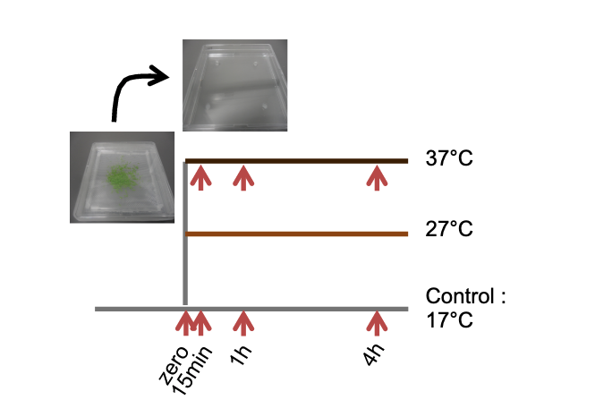

```{r setup, include=FALSE}
knitr::opts_chunk$set(echo = TRUE)
```

<br>

# Consignes générales

<br>

**Téléchargez le dossier Exam_blanc dans Moodle qui contient:**

**- Un fichier `exam_blanc.html` qui contient l'énoncé de l'exam blanc (une copie de cet énoncé) **

**- Un fichier `exam_blanc.R` qui contient le script R dans lequel vous allez mettre vos scripts et réponses aux questions**

**- Un dossier `data` qui contient les données**

<br>

**Ouvrez `exam_blanc.R` et sauvez le dans le même dossier sous le nom `Exam_blanc_numéro_etudiant.R` en remplaçant `numéro_etudiant` par votre propre numéro.** 

<br>

**Pour chaque question:**

**- Commentez le code (en utilisant #) pour expliquer ce que vous allez faire et pourquoi vous utilisez telle ou telle fonction**

**- Utilisez des commandes appropriées pour répondre à la question**

**- Et finalement répondez (en commentant avec un #) à la question grâce au résultat des commandes**

<br>

<span style="color: red;">**L'exam blanc fini à 9h30. Quand vous avez fini, envoyez votre script `Exam_blanc_numéro_etudiant.R` à sandra.cortijo@cnrs.fr** </span>


<br>

# Description des données

Aujourd'hui, vous allez analyser des données extraites de [Cortijo et al., 2017](https://www.sciencedirect.com/science/article/pii/S1674205217302459?via%3Dihub). 

Il s'agit de données issues d'expériences pour mesurer l'expression des gènes en réponse à la chaleur chez *Arabidopsis thaliana*. Pour cela des plantes ont été mises à pousser à 17°C et ont ensuite été transférées à 17°C (contrôle), à 27°C (chaleur) et à 37°C (stress chaleur). 

Afin de suivre la dynamique d'expression en réponse à chaque traitement, les plantes ont été collectées aux temps zero (moment du transfert) et après 15min, 1 heure et 4 heures à chaque traitement. 
Voir le schéma ci-dessous indiquant le plan expérimental (Fig S1a de l'article)




Pour chaque échantillon, l'expression pour l'ensemble des gènes d'*Arabidopsis thaliana* a été mesurée (un peu moins de 30000 gènes). Ensuite seuls les **1035 gènes** qui changent d'expression en réponse à la chaleur ont été conservés. C'est sur ces gènes que vous allez travailler.

<br>

Nous sommes intéressés en particulier aux changements d'expression en réponse à la température et au cours du temps pour ces gènes. Afin de s'affranchir des niveaux d'expression différents entre les gènes (certains sont fortement ou faiblement exprimé peu importe la réponse à la température), et de se concentrer sur la réponse à la température les données ont été transformées avec la formule suivante:

$$
log_2(\frac{\text{expréssion à la température et temps étudiés}}{\text{expression au temps zéro}})
$$

Cette transformation des données est couramment utilisée dans ce domaine d'étude pour étudier la réponse de l'expression des gènes à un stimulus.

Les valeurs obtenues sont centrées autour de zéro. Pour chaque gènes:

- Les **valeurs positives** indiquent une expression à la température et temps étudiés **supérieure** à celle au temps zéro

- Les **valeurs négatives** indiquent une expression à la température et temps étudiés **inférieure** à celle au temps zéro

<br>

Pour aller plus loin, les auteurs ont regroupé ensemble les gènes qui ont des profils d'expression similaires au cours du temps. Par exemple tous les gènes qui ont une augmentation qui s'accroît avec le temps en réponse à la chaleur ont été regroupés ensemble. De cette manières ils ont identifié **7 groupes**, appelés **clusters**.

<br>

Les données sur lesquelles vous allez travailler sont dans le tableur _data_expression_cortijo2017.txt_ qui contient **une ligne pour chacun des 1035 gènes**, et **une colonne pour chaque condition**: 

- 15 minutes à 17°C

- 1 heure à 17°C

- 4 heures à 17°C

- 15 minutes à 27°C

- 1 heure à 27°C

- 4 heures à 27°C

De plus **une colonne indique à quel cluster appartient chague gène**.


# Préparation de l'environnement de travail

### Question 0

Préparez votre environnement de travail:

> Chargez les librairies dont vous aurez besoin.


> Réglez votre répertoire de travail pour vous situer dans le dossier contenant l'examen blanc


> Chargez le fichier _data_expression_cortijo2017.txt_ (qui est dans le dossier _data_) dans R et sauvez le dans un objet


*Aide*: Utilisez la fonction appropriée pour le type de données (dans ce cas colonnes séparées par une tabulation)


# Vérification des données

### Question 1


Avant d'analyser les données, la première étape consiste à vérifier que le tableau importé dans _R_ contient bien les données attendues.

> Est-ce que le tableau importé dans R contient le bon nombre de gènes?
>
> Est-ce que le tableau importé dans R contient les données d'expression dans les 6 conditions (15 minutes à 17°C, 1 heure à 17°C, 4 heures à 17°C, 15 minutes à 27°C, 1 heure à 27°C et 4 heures à 27°C) ainsi que l'information pour le cluster d'appartenance de chaque gène? (Expliquez quelle commande vous permet de répondre)

<br>

### Question 2

> Est-ce que le tableau importé dans R contient bien le nombre de clusters attendus?
> Quels sont leurs noms?

<br>

### Question 3

Avant de faire cette expérience à grande échelle, les chercheurs ont étudié quelques gènes en particulier. Avant d'aller plus loin dans l'analyse, une dernière vérification consiste à s'assurer que ces gènes se comportent comme attendu dans notre jeu de données.

Ces gènes sont:

- **AT1G04520**: Les chercheurs ont préalablement observé que l'expression de ce gène diminue au cours du temps à 17°C et 27°C et que cette diminution est plus rapide est plus importante à 27°C.


- **AT3G12580**: Les chercheurs ont préalablement observé que l'expression de AT3G12580 augmente à 27°C de manière rapide et atteint son pic d'expression en 15 minutes avant de redescendre.


> Faites un graphique montrant l'évolution au cours du temps de l'expression de ces deux gènes à 17°C et 27°C. Obtenez vous des comportement d'expression correspondants aux résultats préliminaires effectués sur ces deux gènes?
>
>
> *Note*: Gardez en tête que le temps zéro n'est pas représenté sur le graphique, mais que compte tenu de la méthode de normalisation la valeur au temps zéro est de 0 pour tous les gènes.
>

*Aide: Pour effectuer ce graphique, filtrez tout d'abord les données pour garder les deux gènes d'intérêt, changez le format du tableau pour passer un format long avec une colonne contenant la condition expérimentale comme clé et une colonne contenant les valeurs d'expression comme valeur. Ensuite séparez la colonne avec les conditions expérimentales afin que la température et le temps du traitement soient dans deux colonnes différentes. Vous pouvez maintenant faire un graphique avec des points représentant l'expression au cours du temps en colorant les données par température, avec un facet par gène.*


<br>


# Analyse de l'expression des gènes

Nous pouvons maintenant faire l'analyse à proprement parler des données. Chaque cluster représentant un type de réponse différente, nous allons les analyser plus en détail. 


### Question 4

> Combien de gènes y a-t-il dans chaque cluster?

*Aide*: groupez les données par cluster puis calculez la statistique résumée qu'est le nombre d'observations

<br>

# Analyse de la fonction des gènes

### Question 5

Maintenant que nous connaissons la réponse de l'expression des gènes à la température, nous souhaitons en savoir plus sur leur fonction.

Malheureusement la table contenant les données d'expression ne contient que l'*AGI* des gènes qui est un identifiant unique pour chaque gène d'*Arabidopsis thaliana*, mais ne nous donne aucune information sur sa fonction.

L'information sur la fonction des gènes se trouve dans la table _gene_fonction_cortijo2017.txt_.
Cette table contient dans sa colonne `gene` les gènes d'Arabidopsis, leur description dans la colonne `Primary_Gene_Symbol`, et la colonne `heatRelated` contient "Yes" si le gène est impliqué dans la réponse à la chaleur, "No" sinon.

> Chargez la table _gene_fonction_cortijo2017.txt_ dans R.
>
> Puis combinez la avec la table contenant l'expression des gènes ( _data_expression_cortijo2017.txt_ chargée en début d'examen) de manière à rajouter l'information sur la fonction des gènes à la table contenant l'expression des gènes et le cluster d'appartenance de chaque gène
>

<br>


Parmi les gènes étudiés plus en détail, **AT3G12580** est intéressant car son expression augmente rapidement en réponse au traitement à 27°C. 

> A partir de la nouvelle table combinée, trouvez le nom de AT3G12580. Quelle fonction ce nom suggère t-il pour AT3G12580 en réponse à la chaleur?

<br>

AT3G12580 fait partie du cluster 6A.

> Filtrez la table combinée pour ne garder que le cluster 6A et déterminez combien de gènes de ce cluster répondent à la chaleur. 
>
> Faites la même chose pour la table contennant tous les gènes. Combien de gènes dans la table complète répondent à la chaleur? 
>
> Qu'est ce que le nombre de gènes répondant à la chaleur dans le cluster 6A par rapport à la table entière indique-t-il?


******

<br>

## FIN DE L'EXAMEN BLANC

**Note** : contrairement à cet examen blanc, le réel examen contiendra aussi quelques questions sur les cours magistraux en plus des compétences en programmation.


